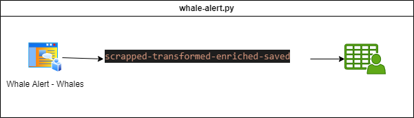

# Data Processes 

In this repositry you can find Airflow dags where I can generate diferent data process.

## Whale Alert 

Whale alert is an scraper which can be used for known how many bitcoins, or other criyptocurrencies are considered a whale.

 

# TODOS

Whale Alert - https://whale-alert.io/whales.html - Whale alerts have in their documentation: https://docs.whale-alert.io/#introduction information about the endpoints. But we can’t have information about what a whale is. So, we can create a process (and an api) that gives the information to the users. This information is in that web: https://whale-alert.io/whales
* Scraping web alert:
    * Create a table
    * Change format to millions
    * Add the numbers of cryptocurrencies that represent the amount
    * Take into consideration the total volume operated

* Exploring Web alert API
* https://www.blockchainresearchlab.org/2022/07/29/the-role-of-whale-alerts-and-sentiment-in-bitcoins-reaction-to-minting-and-burning-of-tethers-usdt/
